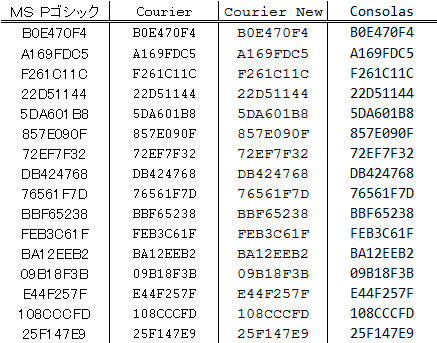

.. index:: Font

.. _Font:

Font
============================
| `Wiki <https://ja.wikipedia.org/wiki/%E7%AD%89%E5%B9%85%E3%83%95%E3%82%A9%E3%83%B3%E3%83%88>`_
| いつも何気なく使っているFontだが、これには大きく分けて2種類ある。

* Monospaced Font(等幅フォント)
    全ての文字の幅が同じ
* Proportional Font(可変幅フォント)
    見た目がきれいになるように幅を変えてある

| なんだかんだよく使ってるMS ゴシックとか明朝とはは全部 Proportional Fontである。
| しかしこれを使用するとソースコードや表が見難くなる。
| 以下に表として列挙したので見比べてみよう。
| 個人的にはConsolasが縦幅も等しく見やすいので多用している。

