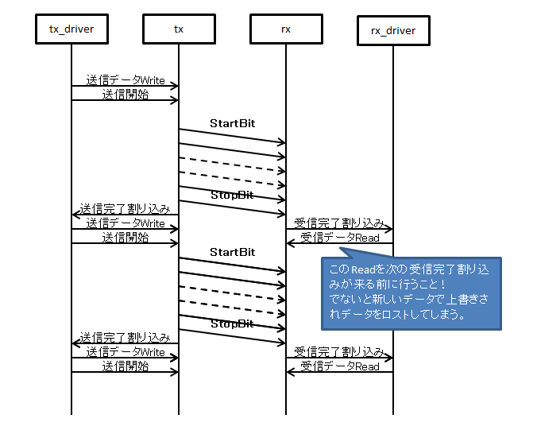

UART通信
====================
| マイコン間通信で多用されるUART通信について

概要
----------
UART通信とは、詳細はググれば出てくるのだが、単純に言えば以下のような通信である。

* | 2つのマイコン間で互いのTX端子をRX端子に、RX端子をTX端子に結線する。
  | 結線した2本の線は共にPULLUPする。

  .. note::
    | TXとRX端子を繋いでいるため、一応送信受信同時に行うことができる。
    | が、通信の堅牢性、確実性保持のためにあんまり行われない。

* 1byteのデータを以下のようにラッピングして送る。
    * StartBit[L]
        | ここでPULLUPされてHighになっているTX線をLowに落とす。
        | これをみて受信側は今から通信が来ると身構える。
    * 送信データの1-8bit
        | 1bit目から順番に1byte分のデータを送信する
    * ParityBit(0-2)
        | 1byte分のデータが正しいかどうかを確認するための情報
        | 0～2bitのデータであり、0bitではそもそも送信しない
        | 通信前に事前に何bitにするか決めておく
    * StopBit[H](1-2)
        | これで1byte分の全情報を送信したことを通達するために必ずTX線をHighにする。
        | 通信前に事前に何bitにするか決めておく

    .. note::
        | 7bitで送信する場合もあるが、どう考えても面倒になる為使わない。
        | だって1byteって8bitですよ？余りどうするの？

* 送信側と受信側で共通の設定を決める
    **ボーレート**
        1秒当たり何ビット通信するか

    **ParityBit**

    **StopBit**

* 複数byte送信する場合はStartBitからStopBitまでを送信したいbyte数分繰り返す。

マイコンの動作
-----------------------
| 設定としてボーレート、ParityBit、StopBitを設定する。
| 後は送信側は1byte分の送信データレジスタに送信したいデータを書き込み、
| 送信開始レジスタを叩くと設定に従い送信する。
| 送信が完了すると送信完了割り込みを発行する。
| 送信完了割り込みの処理内で、次データがあれば送信データレジスタにWriteし送信開始レジスタを叩き送信する。
| 受信側は1byte分データが溜まったら1byte分の受信データレジスタに格納し
| 受信完了割り込みを発行する。
| 受信完了割り込みの処理内で受信データレジスタに格納されているデータをReadし内部バッファに保存する。

用途
------
| 主にマイコン間のデータ通信で使用される。
| ボーレートがある程度低く、自由度が高い為何かと便利

欠点
--------
通信の確実性や連続性において、上記の仕様だけでは問題点がある。

1. 受信側は全部で何byte来るのか分からない。
2. 複数メッセージを連続で受信する場合、どこまでが1通目でどこからが2通目か分からない。
3. 一応ParityBitがあるとはいえ、受信側はデータの整合性が確認できない。
4. 送信側は受信側が受信に成功したのか分からない。

拡張プロトコル
-------------------
上記欠点を解消するために、大抵通信仕様が定められている。

1. メッセージ1通の最大バイト数
    | 欠点1対策
    | 受信側も送信側もメッセージ送受信用のバッファをどれだけ用意する必要があるのかをこれで規定する。
    | これを超過するデータを送信する場合は複数メッセージに分割して送信する。

2. メッセージの送信開始、終了の合図
    | 欠点1,2対策
    | これはケースによって大きく異なる。
    | 見たことがあるのは以下の通りである。

    * メッセージの構造を共通化し、そこにデータ長を格納する。
        受信側は最初の数byteで全体のサイズを把握しそのデータ長分受信したらメッセージ受信完了とする。

    * メッセージの最初と最後のデータを決める
        これには大きく分けて2通りある。

        * 改行文字が来たらそこまでで1メッセージとする
            | CUIが基本的にこの形式である
            | ターミナルでコマンドを送信する場合はこの形式をとる場合が多い
            | CUIで打ち込まれるデータは基本的にASCII制御文字を使用しない為、非常に分かり易い

        * メッセージをASCIIコードのSTX(0x02)とETX(0x03)で囲む
            | 送受信は1byte毎で行うため、分かりやすい開始データ、終了データはASCIIコード表にあるこの二つとなる。
            | しかし、これを使用する場合、メッセージ本文はASCII制御文字を使用しないようにしなければならない。
            | が、内部で使用しているデータやメッセージは基本的にASCII制御文字かどうかなんて意識していない為、
            | ドライバなどでデータの変換が必要になる。
            | この変換が面倒な上に通信料が増加する為あまり使用されない。

    * 一度に送受信するメッセージの長さを決めてしまう。
        | 例えば一度に20byteで送信するように決める。
        | そしてたとえ6byteしか送らない場合でも残り14byte何かしらのデータを詰めて送ってしまえというもの。
        | 通信に無駄が発生する為ほぼ使用されない。

    * TX、RX以外の端子を結線し、そちらで送信開始、完了の合図をする。
        | UARTだけで伝わらないなら他でやればいいじゃないというコロンブスの卵的発想

3. メッセージ内にメッセージ全体の整合性確認用のデータを格納する。
    | 欠点3対策
    | 大抵メッセージの末尾に置かれる。
    | 受信側はメッセージ受信完了後にそのデータを用いて整合性を確認する。

4. 受信側はメッセージの受信が成功したら結果を返信する
    | 欠点4対策
    | そのままの対応である。
    | この返信の形式はUARTで結果を返信する場合とそれ以外の線で行う場合がある。

    .. note::
        通信が失敗したら規定回数リトライする。

